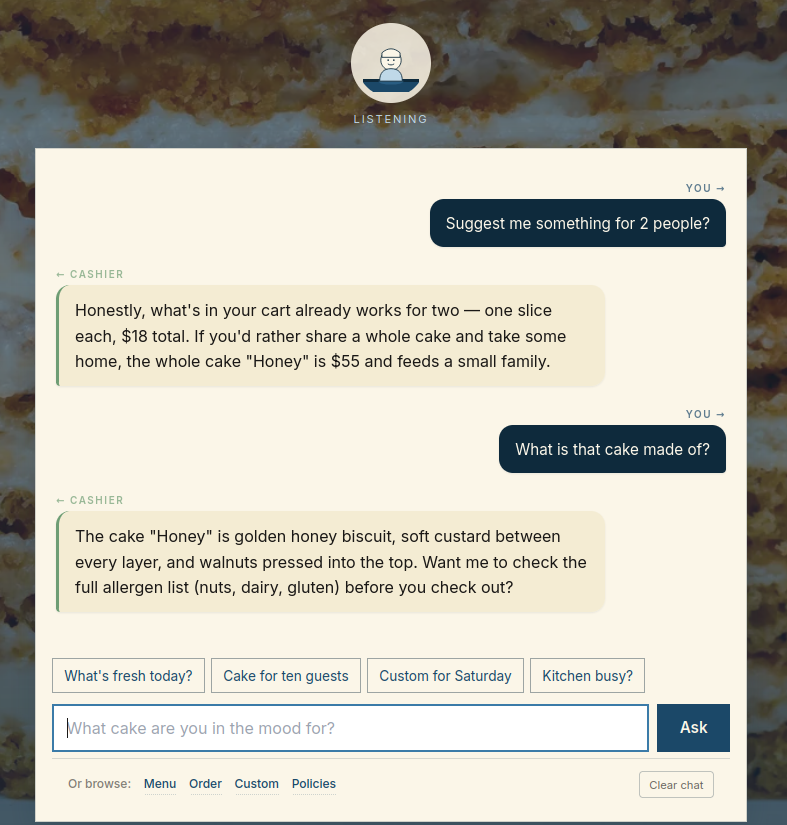
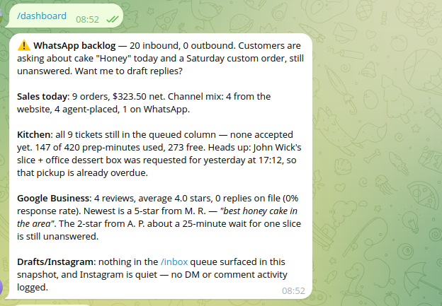
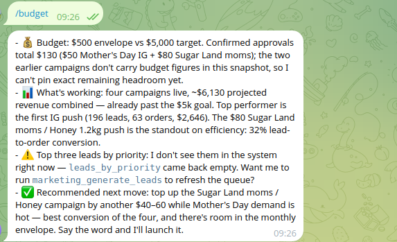

# HappyCake AI — Steppe Business Club hackathon submission

> An AI-assisted sales and operations system for **HappyCake US** (Sugar
> Land, TX cake business). Submission for the Steppe Business Club
> *Agentic AI for Real Business* hackathon (May 9–10, 2026).
>
> One persona, every customer touchpoint: storefront chat, WhatsApp,
> Instagram. One owner cockpit: Telegram. Every customer-facing claim is
> grounded in a live MCP tool call. **Runtime model**: `claude-opus-4-7`
> via the `claude` CLI subprocess (no Anthropic SDK in production).
> **MCP server**: hosted by Steppe Business Club; 55 tools across 8
> families.

## TL;DR — what to evaluate

There are three independent surfaces you can poke. Each is fully
exercised by the runtime persona; none use canned answers.

1. **Storefront + on-site chat** — the script prints a public ngrok HTTPS
   URL; open it, browse the catalog, ask the chat widget about prices,
   timing, allergens, custom orders. Everything the chat says is grounded
   in a live MCP tool call (or it refuses cleanly).
2. **Owner cockpit on Telegram** — DM your bot, send `/start` (with the
   `OWNER_PASSPHRASE` if you set one), then try `/dashboard`, `/budget`,
   `/inbox`, `/notify` (tap a preset to set the push cadence), or any
   free-text question. Replies are
   MCP-grounded too.
3. **Persona-driven channel coverage** — `uv run python
   scripts/test_persona_channels.py` puts a real customer message on
   WhatsApp, Instagram DM, and Google Business reviews **through the
   runtime persona on the live MCP** and writes a scorecard to
   `data/scorecard_persona_<utc-ts>.json`. This is the most economical
   single-command proof the channels work end-to-end.

A complete evaluator path on a clean machine is in **Quickstart** below.
If the team's hosted demo is still up at evaluation time, see
**Live demo (current snapshot)** to skip the local boot.

## Prerequisites

Available on the hackathon-prepared environment; on a clean Linux/macOS
machine install once:

| Tool | Why | Install hint |
|---|---|---|
| Python ≥ 3.12 | Backend runtime | system package, `pyenv`, etc. |
| [`uv`](https://docs.astral.sh/uv/) | Python deps + venv (replaces pip/poetry) | `curl -LsSf https://astral.sh/uv/install.sh \| sh` |
| Node ≥ 20 + npm | Astro storefront build (no runtime JS bundler — JS ships as static `dist/`) | nvm, fnm, or system package |
| [`claude`](https://docs.anthropic.com/en/docs/claude-code) (Claude Code CLI) | The runtime LLM. The bridge shells out to `claude -p` — no Anthropic SDK in production, per brief. | `npm i -g @anthropic-ai/claude-code` |
| [`ngrok`](https://ngrok.com/) | Public HTTPS tunnel for the storefront + Meta-shaped webhooks | platform package + free authtoken |

You also need two account-bound secrets (next section).

## Quickstart

```bash
git clone https://github.com/birlikov/dust2ai_steppe_hackaton.git hackaton
cd hackaton
cp config/.env.example .env
# Edit .env (see table below) — only two values are strictly required.
./scripts/run.sh                  # full demo (bot + always-on world poller + storefront + ngrok)
# ./scripts/run.sh --no-bot       # storefront + ngrok only (skip Telegram + poller)
# ./scripts/run.sh --no-poller    # bot + storefront + ngrok, no world-event listener
#                                 # (use when running scripts/run_scenario.py against the same team token)
# ./scripts/run.sh --no-ngrok     # local dev on :8000
```

Required values in `.env`:

| Var | How to get it | Required? |
|---|---|---|
| `TELEGRAM_BOT_TOKEN` | DM `@BotFather` on Telegram → `/newbot` → follow prompts. Note the username it gives you (`@your_bot_handle`) — that's the bot you'll DM. | ✓ |
| `SBC_TEAM_TOKEN` | Steppe Business Club hackathon dashboard at <https://www.steppebusinessclub.com/hackathon>. | ✓ |
| `NGROK_AUTHTOKEN` | <https://dashboard.ngrok.com/get-started/your-authtoken> (free tier is fine). | strongly recommended |
| `OWNER_PASSPHRASE` | **Leave empty** for fresh-clone evaluation — open-pair mode means the first `/start` pairs your chat. Set to a hard-to-guess string only if you want to gate access (the team's hosted demo at `@happycake_agent_bot` uses the published passphrase from the **Live demo** section above). | optional |
| `OWNER_CHAT_ID` | Auto-captured on first paired `/start`; you can leave it blank. | optional |

`./scripts/run.sh` then validates `.env`, regenerates `.mcp.json`,
patches `.claude/settings.local.json` (so the `claude -p` subprocess can
call MCP tools without prompting), runs `uv sync` + `npm install`, builds
the Astro storefront with `PUBLIC_API_BASE=""` (relative URLs), launches
FastAPI on `:8000`, starts the Telegram bot, and opens an ngrok tunnel.
At the end it prints a summary block with the public URL and the bot
username. `Ctrl-C` tears down everything via the script's trap.

## Live demo (current snapshot)

If the team's tunnel is still up at evaluation time:

| Surface | URL / handle |
|---|---|
| Storefront + on-site chat | <https://1cd5-2606-a300-9008-2a4f-87f1-9f2c-1d82-544b.ngrok-free.app> |
| Machine-readable agent index | <https://1cd5-2606-a300-9008-2a4f-87f1-9f2c-1d82-544b.ngrok-free.app/agent.txt> |
| Live catalog (MCP-backed) | <https://1cd5-2606-a300-9008-2a4f-87f1-9f2c-1d82-544b.ngrok-free.app/api/catalog> |
| Static catalog (build-time fallback) | <https://1cd5-2606-a300-9008-2a4f-87f1-9f2c-1d82-544b.ngrok-free.app/catalog.json> |
| Telegram owner bot | `@happycake_agent_bot` |

### Pairing your Telegram chat with the team's bot

The team's hosted bot uses a published passphrase so judges can DM it cold:

1. Open Telegram → DM **@happycake_agent_bot**
2. Send a message that is exactly: `happycake-judge-2026`
3. The bot replies *"Paired."* and the chat is now the authorised owner.
4. Try `/dashboard`, `/budget`, `/inbox`, `/notify`, `/refund`, `/drain_threads`,
   or just type a free-text question (*"sales today?"*, *"anything urgent?"*).

**Pairing is single-seat**: the schema (`owner_identity` table with
`CHECK (id = 1)`) holds at most one paired chat at a time, so the most
recent passphrase send replaces any prior pair. If you and another
judge want to evaluate concurrently, run the **Quickstart** below to
get your own bot from a fresh clone — it's faster than coordinating
re-pairs. The passphrase is intentionally public for evaluation; the
simulator is sandboxed per team token so a random pair-hijacker can't
reach real customer data.

To unpair, send `/logout`. Re-pair with the same passphrase any time.

> **ngrok-free URLs rotate** when `./scripts/run.sh` restarts. If the
> link 502s, run the Quickstart locally — your own URL appears in the
> script's final summary. The first browser hit shows ngrok's interstitial;
> internal fetches send `ngrok-skip-browser-warning: true` to bypass it.

### What it looks like

**Storefront cashier chat** — talk to the HappyCake cashier directly
on the homepage. Every reply grounded in a live MCP tool call.



**Owner Telegram cockpit — `/dashboard`** — five-bullet brief
covering today's sales, kitchen tickets, live conversations, GB
review pulse, and drafts pending. Composed by the owner-bridge from
parallel `square_*` / `kitchen_*` / `gb_*` / `marketing_*` calls.



**Owner Telegram cockpit — `/budget`** — marketing snapshot: $500
envelope status, top-3 leads sorted by `priority_score` (margin ×
source-weight × recency), recommended next move.



## What's wired

Six outcomes from brief §3, all served by the same MCP-grounded runtime
persona:

| # | Outcome | Where it lives | Key tools |
|---|---|---|---|
| 1 | Website / storefront | `web/` (Astro + Tailwind) → `/api/catalog` + `POST /api/chat` + `POST /api/order` | `square_list_catalog`, `kitchen_get_capacity` |
| 2 | Agent-friendly site | JSON-LD `Product` + `Offer` per product page; `/api/catalog`, `/sitemap.xml`, `/robots.txt`, `/agent.txt` (machine-readable index for crawling agents); predictable URLs | (read-only artefacts) |
| 3 | On-site assistant | Floating cashier widget → `POST /api/chat` → orchestrator → `claude -p` (with MCP). Cart-aware: knows what's in the basket and can place orders end-to-end | every relevant family |
| 4 | WhatsApp | The bot process spawns an always-on `WorldRunner` that drives `WorldPoller` (drains `world_next_event`) → orchestrator → `whatsapp_send`. Accepted orders auto-fire `square_create_order` + `kitchen_create_ticket` and push a one-line `📦` summary to the owner Telegram chat. `--no-poller` disables the always-on listener for scripted-scenario runs. | `square_create_order`, `kitchen_create_ticket`, `whatsapp_send` |
| 5 | Instagram | DMs + comments through the same poller; feed-post drafts go through `/inbox` (Approve / Edit / Reject inline keyboard) per brandbook §7 | `instagram_send_dm`, `instagram_reply_to_comment`, `instagram_schedule_post`, `instagram_approve_post`, `instagram_publish_post` |
| 6 | $500 marketing plan + channel coverage | `docs/MARKETING_PLAN.md` (human plan) + `scripts/seed_marketing.py` (executable closed loop) + `scripts/test_persona_channels.py` (WA + IG + GB through the runtime persona end-to-end) | full `marketing_*` family + `evaluator_score_*` |

Customer orders are **auto-confirmed** on the `POST /api/order` path —
the owner does not gate them. `/inbox` is reserved for marketing posts
(IG captions, GB posts, paid-ad creatives) where brandbook §7 requires
owner approval.

## Owner controls (Telegram bot)

The team's hosted bot is `@happycake_agent_bot`. When you run the
Quickstart yourself, your bot has whatever username you set in BotFather.
The command set is identical.

| Command | What it does |
|---|---|
| `/start` | Pair this Telegram chat as the owner (gated by passphrase in `.env`); from then on, order-push and `/inbox` notifications land here. |
| `/help` | Lists every command and how to use it. |
| `/dashboard` | One-screen view: today's sales mix, kitchen utilisation, urgent items, drafts pending. |
| `/budget` | Marketing budget remaining + recent attributed leads. |
| `/inbox` (alias `/drafts`) | Marketing posts queued for Approve / Edit / Reject. Survives bot restart (SQLite). |
| `/notify` | Set push cadence. Plain `/notify` shows current setting + an inline keyboard (1 min / 30 min / 2 h / Off / Default — current option ✓-marked). Text args (`/notify 30m`, `/notify off`) still work. |
| `/refund` | Bare `/refund` shows the last 10 orders as inline buttons; tap to draft a refund offer. The draft lands in `/inbox` for Approve / Edit / Reject. |
| `/drain_threads` | Drain unanswered WhatsApp + Instagram threads through the persona — useful when a backlog has built up while the bot was offline. |
| `/cancel` | Cancel the current step. |
| `/restart` | Wipe conversation memory for this chat. |
| `/logout` | Unpair this Telegram chat from the owner identity. |

Free-text DMs go through the same orchestrator the customer-facing
channels use, with the owner-side persona (`owner_agent/*.md`) loaded
instead of the customer one.

## Architecture in one paragraph

We run **two Claudes**. Dev Claude (this repo's `CLAUDE.md`) plans,
codes, reviews. Runtime Claude — the customer-facing HappyCake assistant
— has its system prompt composed from four small files under `agent/`
(SOUL, RULES, TOOLS, EXAMPLES) and is invoked by
`src/agents/claude_bridge.py` shelling out to
`claude -p --system-prompt …` with `ANTHROPIC_MODEL=claude-opus-4-7`.
The owner-facing variant is composed the same way from `owner_agent/`.
The bridge inherits MCP plumbing from `.claude/settings.local.json`, so
the runtime can call MCP tools directly. Every channel (Telegram,
WhatsApp, Instagram, website chat, world events) routes through one
`Orchestrator` that adds session history, brand-voice lint, and an
audit-log entry. Full diagram in **`ARCHITECTURE.md`**.

## Live evidence

The team's last persona-channel run against the live MCP scored:

| Dimension | Score | Note |
|---|---|---|
| `evaluator_score_channel_response` | **80 / 100** | Brand-correct replies on WhatsApp, Instagram DM, and Google Business — generated by the runtime persona, not canned strings |
| `evaluator_score_world_scenario` | **100 / 100** | 9 events in timeline, 6 delivered, 200 audit calls |
| `whatsappInbound` | 8 | Live world events drained by `WorldPoller` |
| `auditCalls` | 200 | MCP-call evidence |

Verbatim per-channel excerpts (with proof points) are in
**`docs/SUBMISSION_EVIDENCE.md`**. Outbound counters are credited via
the evaluator scoring, not raw counts.

To produce your own scorecard against the live MCP:

```bash
uv run python scripts/test_persona_channels.py
# → data/scorecard_persona_<utc-ts>.json
```

The `data/` directory is gitignored, so the scorecards aren't committed —
running the test is the canonical way to reproduce this evidence on a
fresh clone. Repeat as often as you like; each run rotates the timestamp.

## Where each piece of evidence lives

| Evaluator dimension | Where to look |
|---|---|
| Architecture, agent loop, two-Claude pattern, MCP usage | `ARCHITECTURE.md` (313 lines, diagrams + tables) |
| Acceptance criteria per workflow | `docs/specs.md` (one row per AC, brief-analyst output) |
| Per-tool MCP catalog with schemas | `docs/mcp_inventory.md` (55 tools across 8 families) |
| Brand voice + hard rules | `HCU_BRANDBOOK.md` (the runtime's source of truth) |
| Web ↔ backend contract | `docs/CONTRACTS.md` |
| $500 → $5,000 marketing case | `docs/MARKETING_PLAN.md` |
| Scripted demo + smoke runbook | `docs/DEMO.md` |
| Live evaluator snapshots | `docs/SUBMISSION_EVIDENCE.md` |
| Critic / self-audit | `docs/critic_report.md` |
| Storefront-only README | `web/README.md` |
| Customer-facing persona | `agent/{SOUL,RULES,TOOLS,EXAMPLES}.md` |
| Owner-facing persona | `owner_agent/{SOUL,RULES,TOOLS,EXAMPLES,SKILLS}.md` |

## Repo layout

```
agent/             Customer-facing runtime persona (SOUL, RULES, TOOLS, EXAMPLES)
owner_agent/       Owner-facing persona — same shape
src/               Application code (agents, bot, webhooks, mcp, workflows, storage, core)
web/               Astro + Tailwind storefront with cart-aware chat widget
tests/             pytest unit + integration + scenario YAML
scripts/           run.sh, demo.sh, seed_marketing.py, test_persona_channels.py, …
docs/              ARCHITECTURE link target, PLAN, specs, MCP inventory, DEMO, MARKETING_PLAN, SUBMISSION_EVIDENCE
config/            .env.example, .mcp.json template
assets/            Brand assets (palette, photography references)
data/              Runtime artefacts (gitignored: state.db, scorecards, logs)
HACKATHON_BRIEF.md The unsealed brief, verbatim
HCU_BRANDBOOK.md   Brand voice, palette, hard rules — the runtime's source of truth
```

## Hackathon brief compliance (per `HACKATHON_BRIEF.md` §8)

| Deliverable | Where |
|---|---|
| README, setup from a fresh clone | This file + `./scripts/run.sh` |
| `ARCHITECTURE.md` — agents, routing, MCP usage, owner-bot mapping | `ARCHITECTURE.md` |
| `.env.example` with placeholders only | `config/.env.example` |
| Website / storefront instructions | `web/README.md` + `docs/DEMO.md` |
| Production / local deploy notes | `docs/DEMO.md` |
| Business-impact hypothesis + $500 marketing case | `docs/MARKETING_PLAN.md` |
| Agent-friendly website notes | `web/public/agent.txt` + JSON-LD per page + `/api/catalog` |
| On-site assistant test script | `docs/DEMO.md` + `scripts/test_persona_channels.py` |
| Telegram bots and what each does | "Owner controls" table above |

## License

MIT — see `LICENSE`.
